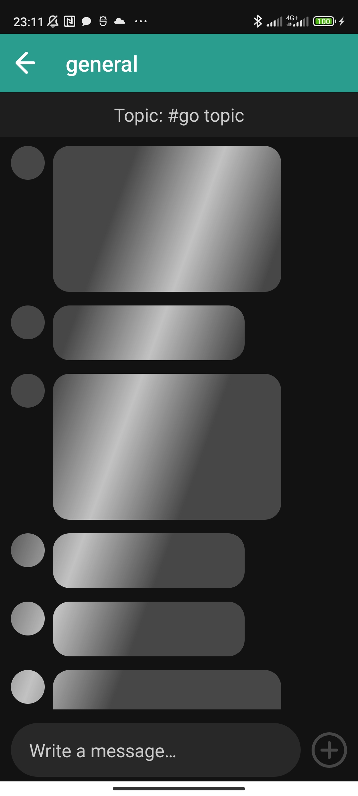

## Zulip Messenger Client📱💬
Zulip Messenger Client is an full-fledged Android messaging application based on powerful [Zulip API](https://zulip.com/api/). Designed for seamless communication, Zulip Messenger Client brings a feature-rich experience to your fingertips, combining real-time messaging, stream-based organization, and intuitive user interactions. 

### Features
-   **Real-time Messaging:** Instant message delivery.
-   **Stream and Topic-based Messaging:** Organize conversations into streams and topics for better collaboration.
-   **User Presence:** See who's online and available to chat.
-   **Message Reactions:** Express yourself with emoji reactions.
-   **Search Functionality:** Quickly find streams and users in the organization.
-   **Offline support:** Work with the app even without an internet connection, with data cached locally for uninterrupted access.

### Screenshots

|   |   |   |
|---|---|---|
|  |  |  |
|  |  |  |
|  |  |  |

### Built with 🛠
-  **[Kotlin](https://kotlinlang.org/)** - The main programming language for Android development.
-  **[Kotlin Coroutines](https://kotlinlang.org/docs/coroutines-overview.html)** - For asynchronous and more..
-  **[Flow](https://kotlinlang.org/api/kotlinx.coroutines/kotlinx-coroutines-core/kotlinx.coroutines.flow/-flow/)** - A reactive data stream, allowing for convinient data processing and transformation.
-   **[Retrofit](https://square.github.io/retrofit/)** - A type-safe HTTP client for Android and Java.
-   **[Room](https://developer.android.com/training/data-storage/room)** - A type-safe database library for Android, offering seamless access to SQLite.
-   **[Dagger](https://developer.android.com/training/dependency-injection/dagger-basics)** - A fully static, compile-time framework for Java, Kotlin, and Android.
-   **[Kotea](https://github.com/tinkoff-mobile-tech/KoTEA)** - Kotlin TEA reactive implementation
-   **[Cicerone](https://github.com/terrakok/Cicerone)** - A lightweight and convinient navigation library for  Android.
-   **[Glide](https://github.com/bumptech/glide)** - An image loading and caching library for Android.
-   **[JUnit5](https://junit.org/junit5/)** - A test automation framework.
-   **[Kaspresso](https://kasperskylab.github.io/Kaspresso/ru/)** - A framework for Android UI testing.
-   **[Wiremock](https://github.com/wiremock/wiremock)** - A tool for mocking HTTP services.

### Contact
For any inquiries, please reach out to my [Telegram](https://t.me/kekouke) or [Gmail](mailto:mikhailkozitskii@gmail.com).
